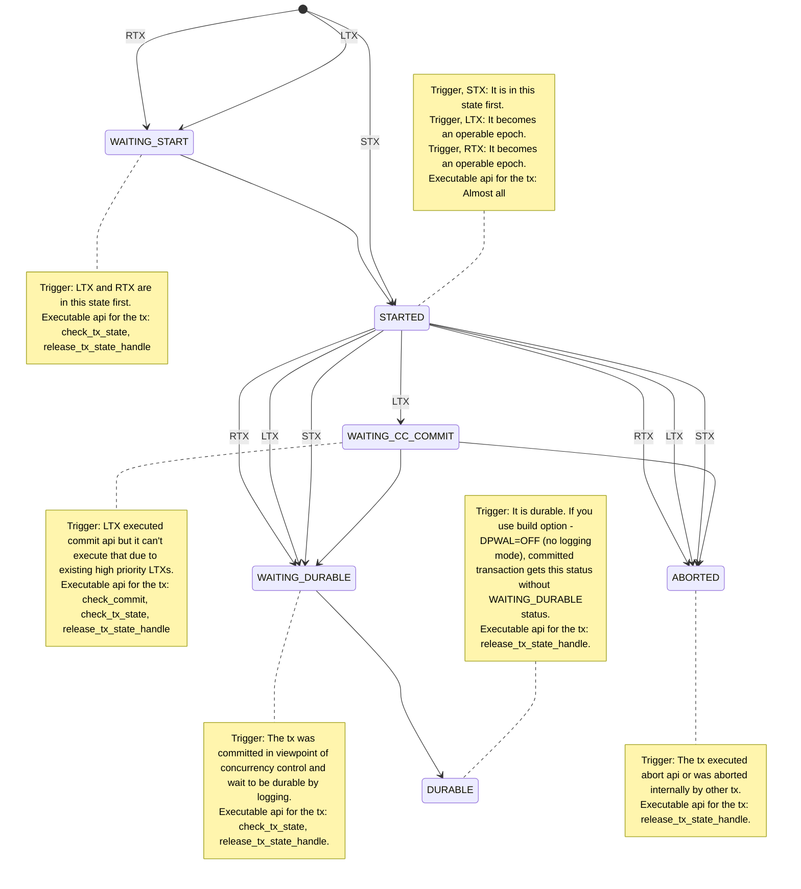

- Definition of words
  - LTX: long tx (started by tx_begin api).
  - RTX: read only tx (started by tx_begin api).
  - STX: short tx.

```mermaid
stateDiagram-v2
    WAITING_START
    note right of WAITING_START
        Trigger: LTX and RTX are in this state first. 
        Executable api for the tx: check_tx_state, release_tx_state_handle
    end note
    STARTED
    note left of STARTED
        Trigger, STX: It is in this state first. 
        Trigger, LTX: It becomes an operable epoch.
        Trigger, RTX: It becomes an operable epoch.
        Executable api for the tx: Almost all
    end note
    WAITING_CC_COMMIT
    note right of WAITING_CC_COMMIT
        Trigger: LTX executed commit api but it can't execute that due to 
        existing high priority LTXs.
        Executable api for the tx: check_commit, check_tx_state, release_tx_state_handle
    end note
    ABORTED
    note right of ABORTED
        Trigger: The tx executed abort api or was aborted internally by other tx.
        Executable api for the tx: release_tx_state_handle.
    end note
    WAITING_DURABLE
    note right of WAITING_DURABLE
        Trigger: The tx was committed in viewpoint of concurrency control and 
        wait to be durable by logging.
        Executable api for the tx: check_tx_state, release_tx_state_handle.
    end note
    DURABLE
    note left of DURABLE
        Trigger: It is durable. If you use build option -DPWAL=OFF (no logging
        mode), committed transaction gets this status without WAITING_DURABLE
        status.
        Executable api for the tx: release_tx_state_handle.
    end note

    [*] --> STARTED: STX
    [*] --> WAITING_START: LTX
    [*] --> WAITING_START: RTX
    WAITING_START --> STARTED
    STARTED --> WAITING_CC_COMMIT: LTX
    WAITING_CC_COMMIT --> ABORTED
    WAITING_CC_COMMIT --> WAITING_DURABLE
    STARTED --> WAITING_DURABLE: STX
    STARTED --> WAITING_DURABLE: LTX
    STARTED --> WAITING_DURABLE: RTX
    STARTED --> ABORTED: STX
    STARTED --> ABORTED: LTX
    STARTED --> ABORTED: RTX
    WAITING_DURABLE --> DURABLE
```

- Comment about  state diagram
--