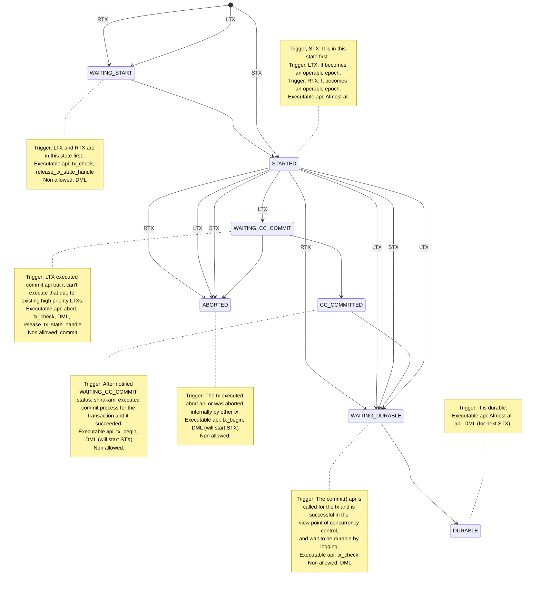

- Definition of words
  - DML: Api of shirakami (open_scan, next, read_key_from_scan,
  read_value_from_scan, close_scan, delete_record, exist_key, insert, search_key,
  update, upsert
  - LTX: long tx (started by tx_begin api).
  - RTX: read only tx (started by tx_begin api).
  - STX: short tx.

- Comment about  state diagram
--