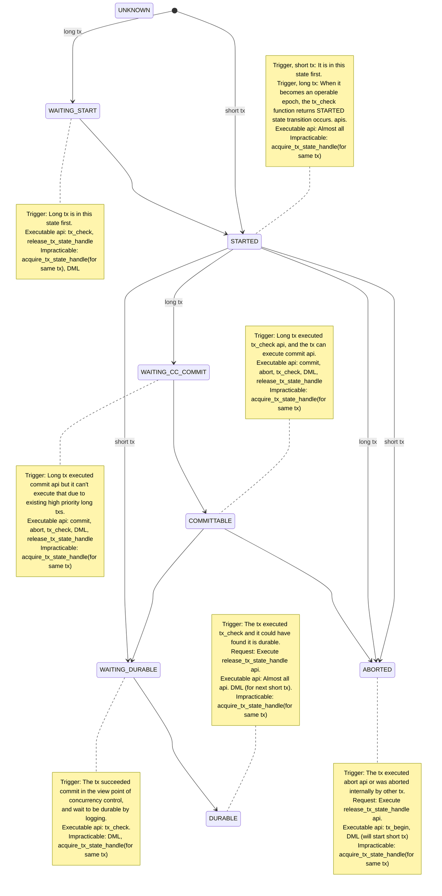

```mermaid
stateDiagram-v2
    UNKNOWN
    WAITING_START
    note right of WAITING_START
        Trigger: Long tx is in this state first. 
        Executable api: tx_check, release_tx_state_handle
        Impracticable: acquire_tx_state_handle(for same tx), DML
    end note
    STARTED
    note left of STARTED
        Trigger, short tx: It is in this state first. 
        Trigger, long tx: When it becomes an operable epoch, the tx_check 
        function returns STARTED state transition occurs. apis.
        Executable api: Almost all
        Impracticable: acquire_tx_state_handle(for same tx)
    end note
    WAITING_CC_COMMIT
    note right of WAITING_CC_COMMIT
        Trigger: Long tx executed commit api but it can't execute that due to 
        existing high priority long txs.
        Executable api: commit, abort, tx_check, DML, release_tx_state_handle
        Impracticable: acquire_tx_state_handle(for same tx)
    end note
    COMMITTABLE
    note left of COMMITTABLE
        Trigger: Long tx executed tx_check api, and the tx can execute commit api.
        Executable api: commit, abort, tx_check, DML, release_tx_state_handle
        Impracticable: acquire_tx_state_handle(for same tx)
    end note
    ABORTED
    note right of ABORTED
        Trigger: The tx executed abort api or was aborted internally by other tx.
        Request: Execute release_tx_state_handle api.
        Executable api: tx_begin, DML (will start short tx)
        Impracticable: acquire_tx_state_handle(for same tx)
    end note
    WAITING_DURABLE
    note right of WAITING_DURABLE
        Trigger: The tx succeeded commit in the view point of concurrency control,
        and wait to be durable by logging.
        Executable api: tx_check.
        Impracticable: DML, acquire_tx_state_handle(for same tx)
    end note
    DURABLE
    note left of DURABLE
        Trigger: The tx executed tx_check and it could have found it is durable.
        Request: Execute release_tx_state_handle api.
        Executable api: Almost all api. DML (for next short tx).
        Impracticable: acquire_tx_state_handle(for same tx)
    end note

    [*] --> STARTED: short tx
    [*] --> WAITING_START: long tx
    WAITING_START --> STARTED
    STARTED --> WAITING_CC_COMMIT: long tx
    WAITING_CC_COMMIT --> COMMITTABLE
    COMMITTABLE --> WAITING_DURABLE
    STARTED --> WAITING_DURABLE: short tx
    STARTED --> ABORTED: short tx
    STARTED --> ABORTED: long tx
    COMMITTABLE --> ABORTED
    WAITING_DURABLE --> DURABLE
```
